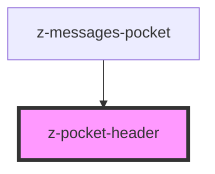

# z-pocket-header

<!-- Auto Generated Below -->

## Properties

| Property   | Attribute  | Description | Type     | Default     |
| ---------- | ---------- | ----------- | -------- | ----------- |
| `pocketid` | `pocketid` | pocket id   | `string` | `undefined` |

## Events

| Event               | Description                    | Type               |
| ------------------- | ------------------------------ | ------------------ |
| `pocketHeaderClick` | Emitted on pocket header click | `CustomEvent<any>` |
| `pocketHeaderPan`   | Emitted on pocket header pan   | `CustomEvent<any>` |

## Slots

| Slot | Description           |
| ---- | --------------------- |
|      | pocket header content |

## Dependencies

### Used by

- [z-messages-pocket](../z-messages-pocket)

### Graph

---

_Built with [StencilJS](https://stenciljs.com/)_
