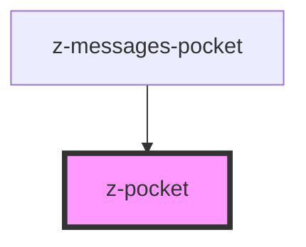

# z-pocket

<!-- Auto Generated Below -->

## Properties

| Property   | Attribute  | Description   | Type                                                               | Default                |
| ---------- | ---------- | ------------- | ------------------------------------------------------------------ | ---------------------- |
| `pocketid` | `pocketid` | pocket id     | `string`                                                           | `undefined`            |
| `status`   | `status`   | pocket status | `PocketStatus.CLOSED \| PocketStatus.OPEN \| PocketStatus.PREVIEW` | `PocketStatus.PREVIEW` |

## Events

| Event          | Description                                            | Type               |
| -------------- | ------------------------------------------------------ | ------------------ |
| `pocketToggle` | Emitted on pocket toggle, returns pocket id and status | `CustomEvent<any>` |

## Methods

### `close() => Promise<void>`

close z-pocket

#### Returns

Type: `Promise<void>`

### `open() => Promise<void>`

open z-pocket

#### Returns

Type: `Promise<void>`

## Slots

| Slot | Description    |
| ---- | -------------- |
|      | pocket content |

## Dependencies

### Used by

 - [z-messages-pocket](../z-messages-pocket)

### Graph

----------------------------------------------

*Built with [StencilJS](https://stenciljs.com/)*
