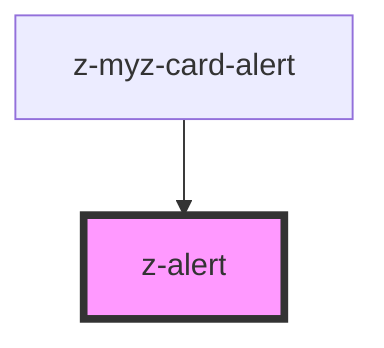

# z-alert

<!-- Auto Generated Below -->

## Properties

| Property | Attribute | Description        | Type                                                                       | Default     |
| -------- | --------- | ------------------ | -------------------------------------------------------------------------- | ----------- |
| `type`   | `type`    | alert variant type | `AlertTypesEnum.ERROR \| AlertTypesEnum.SUCCESS \| AlertTypesEnum.WARNING` | `undefined` |

## Slots

| Slot | Description   |
| ---- | ------------- |
|      | alert content |

## Dependencies

### Used by

- [z-myz-card-alert](../card/z-myz-card-alert)

### Graph

---

_Built with [StencilJS](https://stenciljs.com/)_
