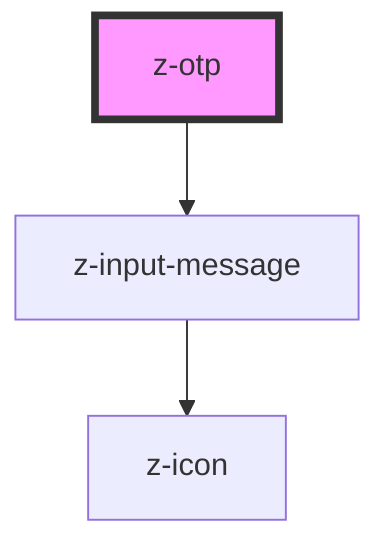

# z-otp

<!-- Auto Generated Below -->

## Properties

| Property   | Attribute   | Description | Type                                | Default     |
| ---------- | ----------- | ----------- | ----------------------------------- | ----------- |
| `inputNum` | `input-num` |             | `number`                            | `6`         |
| `message`  | `message`   |             | `string`                            | `undefined` |
| `status`   | `status`    |             | `"error" \| "success" \| "warning"` | `undefined` |

## Events

| Event       | Description | Type               |
| ----------- | ----------- | ------------------ |
| `otpChange` |             | `CustomEvent<any>` |

## Dependencies

### Depends on

- [z-input-message](../../../components/inputs/z-input-message)

### Graph

----------------------------------------------

*Built with [StencilJS](https://stenciljs.com/)*
