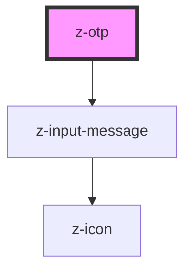

# z-otp

<!-- Auto Generated Below -->

## Properties

| Property   | Attribute   | Description   | Type                                                              | Default     |
| ---------- | ----------- | ------------- | ----------------------------------------------------------------- | ----------- |
| `inputNum` | `input-num` | Input number  | `number`                                                          | `6`         |
| `message`  | `message`   | Input message | `string`                                                          | `undefined` |
| `status`   | `status`    | Input status  | `InputStatus.ERROR \| InputStatus.SUCCESS \| InputStatus.WARNING` | `undefined` |

## Events

| Event       | Description      | Type               |
| ----------- | ---------------- | ------------------ |
| `otpChange` | Otp change event | `CustomEvent<any>` |

## Dependencies

### Depends on

- [z-input-message](../../../components/z-input-message)

### Graph

----------------------------------------------

*Built with [StencilJS](https://stenciljs.com/)*
