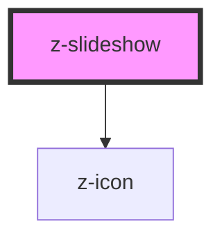

# z-slideshow

<!-- Auto Generated Below -->

## Properties

| Property      | Attribute     | Description                           | Type                 | Default     |
| ------------- | ------------- | ------------------------------------- | -------------------- | ----------- |
| `data`        | `data`        | array or JSON stringified images urls | `string \| string[]` | `undefined` |
| `slideshowid` | `slideshowid` | slideshow id                          | `string`             | `undefined` |

## Slots

| Slot             | Description                  |
| ---------------- | ---------------------------- |
| `"footer-left"`  | left content slot in footer  |
| `"footer-right"` | right content slot in footer |

## Dependencies

### Depends on

- [z-icon](../../../components/z-icon)

### Graph

----------------------------------------------

*Built with [StencilJS](https://stenciljs.com/)*
