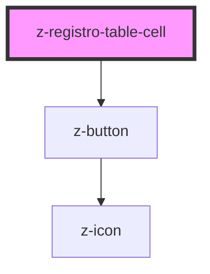

# z-registro-table-cell

<!-- readme-group="registro-table" -->

```html
<z-registro-table-cell></z-registro-table-cell>
```

<!-- Auto Generated Below -->


## Properties

| Property     | Attribute     | Description                            | Type      | Default     |
| ------------ | ------------- | -------------------------------------- | --------- | ----------- |
| `showButton` | `show-button` | [Optional] Show contextual menu button | `boolean` | `undefined` |


## Dependencies

### Depends on

- [z-button](../../../components/buttons/z-button)

### Graph


----------------------------------------------

*Built with [StencilJS](https://stenciljs.com/)*
