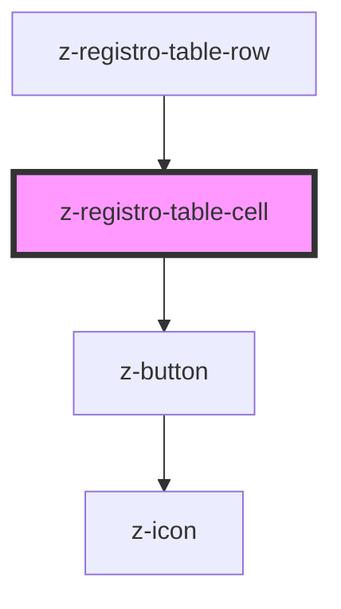

# z-registro-table-cell

<!-- readme-group="registro-table" -->

```html
<z-registro-table-cell></z-registro-table-cell>
```

<!-- Auto Generated Below -->


## Properties

| Property     | Attribute     | Description                                                  | Type                                                                                | Default       |
| ------------ | ------------- | ------------------------------------------------------------ | ----------------------------------------------------------------------------------- | ------------- |
| `padding`    | `padding`     | Set padding size of cell, if special 0px padding will be set | `Size.large \| Size.medium \| Size.small \| Size.special \| typeof Size["x-small"]` | `Size.medium` |
| `showButton` | `show-button` | [Optional] Show contextual menu button                       | `boolean`                                                                           | `undefined`   |


## Dependencies

### Used by

 - [z-registro-table-row](../z-registro-table-row)

### Depends on

- [z-button](../../../components/buttons/z-button)

### Graph


----------------------------------------------

*Built with [StencilJS](https://stenciljs.com/)*
