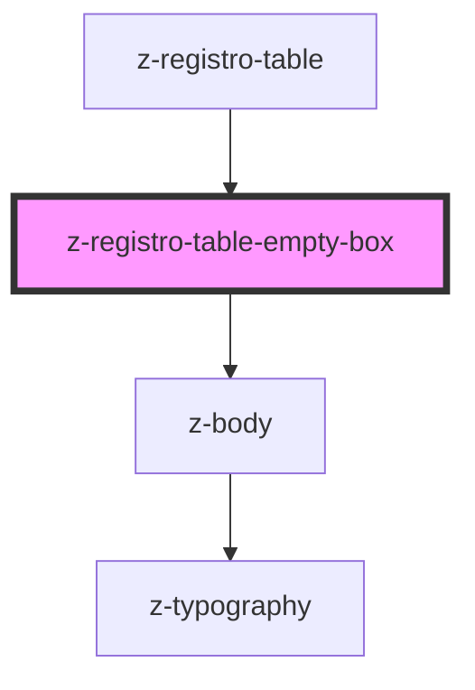

# z-registro-table-sticky-footer

<!-- Auto Generated Below -->

## Properties

| Property   | Attribute  | Description             | Type     | Default                                                                |
| ---------- | ---------- | ----------------------- | -------- | ---------------------------------------------------------------------- |
| `message`  | `message`  | Sets main title message | `string` | `"Siamo spicenti, al momento non sono presenti dati da visualizzare."` |
| `subtitle` | `subtitle` | Sets message            | `string` | `""`                                                                   |

## Dependencies

### Used by

 - [z-registro-table](../z-registro-table)

### Depends on

- [z-body](../../../components/typography/z-body)

### Graph

----------------------------------------------

*Built with [StencilJS](https://stenciljs.com/)*
