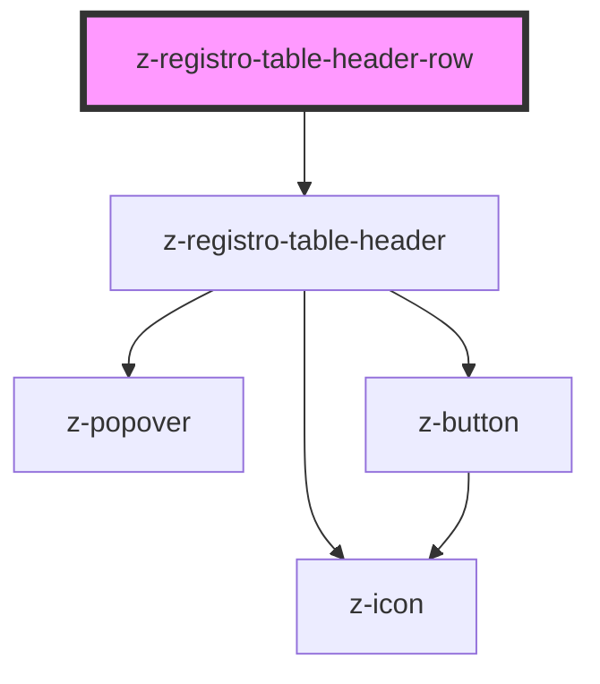

# z-registro-table-header-row

<!-- Auto Generated Below -->

## Properties

| Property     | Attribute    | Description | Type      | Default     |
| ------------ | ------------ | ----------- | --------- | ----------- |
| `expandable` | `expandable` |             | `boolean` | `undefined` |

## Dependencies

### Depends on

- [z-registro-table-header](../z-registro-table-header)

### Graph

---

_Built with [StencilJS](https://stenciljs.com/)_
