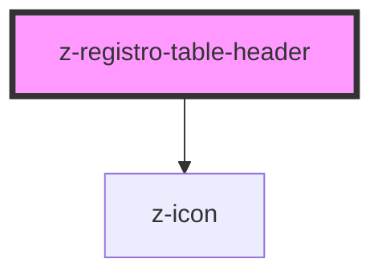

# z-registro-table-header

<!-- readme-group="registro-table" -->

```html
<z-registro-table-header></z-registro-table-header>
```

<!-- Auto Generated Below -->


## Properties

| Property           | Attribute            | Description                            | Type                                                                                | Default                |
| ------------------ | -------------------- | -------------------------------------- | ----------------------------------------------------------------------------------- | ---------------------- |
| `showSorterButton` | `show-sorter-button` |                                        | `boolean`                                                                           | `undefined`            |
| `size`             | `size`               | [Optional] Show contextual menu button | `TableHeaderSize.L \| TableHeaderSize.M \| TableHeaderSize.S \| TableHeaderSize.XS` | `TableHeaderSize["M"]` |


## Dependencies

### Depends on

- [z-icon](../../../components/icons/z-icon)

### Graph


----------------------------------------------

*Built with [StencilJS](https://stenciljs.com/)*
