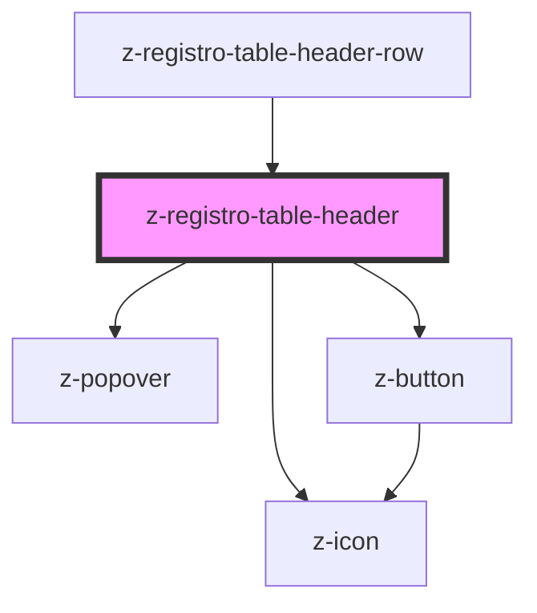

# z-registro-table-header

<!-- readme-group="registro-table" -->

```html
<z-registro-table-header></z-registro-table-header>
```

<!-- Auto Generated Below -->


## Properties

| Property               | Attribute                | Description                            | Type                                                                                                                                       | Default                     |
| ---------------------- | ------------------------ | -------------------------------------- | ------------------------------------------------------------------------------------------------------------------------------------------ | --------------------------- |
| `columnId`             | `column-id`              | Column ID                              | `string`                                                                                                                                   | `undefined`                 |
| `defaultSortDirection` | `default-sort-direction` | [Optional] Default sort order          | `SortDirectionEnum.asc \| SortDirectionEnum.desc \| SortDirectionEnum.none`                                                                | `SortDirectionEnum.asc`     |
| `showButton`           | `show-button`            | [Optional] Show contextual menu button | `boolean`                                                                                                                                  | `undefined`                 |
| `size`                 | `size`                   | [Optional] Padding of the header       | `TableHeaderSize.large \| TableHeaderSize.medium \| TableHeaderSize.small \| TableHeaderSize.special \| typeof TableHeaderSize["x-small"]` | `TableHeaderSize["medium"]` |
| `sortDirection`        | `sort-direction`         |                                        | `SortDirectionEnum.asc \| SortDirectionEnum.desc \| SortDirectionEnum.none`                                                                | `SortDirectionEnum.none`    |
| `sortable`             | `sortable`               | [Optional] Make the header sortable    | `boolean`                                                                                                                                  | `undefined`                 |


## Events

| Event  | Description                     | Type               |
| ------ | ------------------------------- | ------------------ |
| `sort` | [Optional] callback for sorting | `CustomEvent<any>` |


## Dependencies

### Used by

 - [z-registro-table-header-row](../z-registro-table-header-row)

### Depends on

- [z-icon](../../../components/icons/z-icon)
- [z-popover](../../../components/z-popover)
- [z-button](../../../components/buttons/z-button)

### Graph


----------------------------------------------

*Built with [StencilJS](https://stenciljs.com/)*
