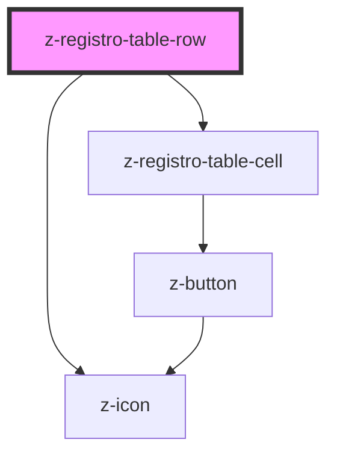

# z-registro-table-row

<!-- readme-group="registro-table" -->

```html
<z-registro-table-row></z-registro-table-row>
```

<!-- Auto Generated Below -->


## Properties

| Property     | Attribute    | Description | Type  | Default     |
| ------------ | ------------ | ----------- | ----- | ----------- |
| `expandable` | `expandable` |             | `any` | `undefined` |


## Events

| Event    | Description | Type               |
| -------- | ----------- | ------------------ |
| `expand` |             | `CustomEvent<any>` |


## Dependencies

### Depends on

- [z-registro-table-cell](../z-registro-table-cell)
- [z-icon](../../../components/icons/z-icon)

### Graph


----------------------------------------------

*Built with [StencilJS](https://stenciljs.com/)*
