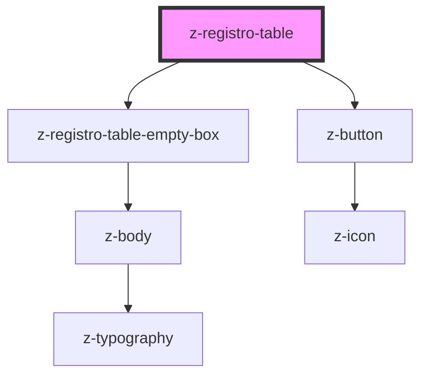

# z-registro-table

<!-- readme-group="registro-table" -->

```html
<z-registro-table></z-registro-table>
```

<!-- Auto Generated Below -->


## Properties

| Property               | Attribute                  | Description               | Type      | Default     |
| ---------------------- | -------------------------- | ------------------------- | --------- | ----------- |
| `bordered`             | `bordered`                 | Sets table with border    | `boolean` | `false`     |
| `callToActionLabel`    | `call-to-action-label`     | Sets call to action label | `string`  | `undefined` |
| `callToActionTwoLabel` | `call-to-action-two-label` | Sets call to action label | `string`  | `undefined` |
| `columnSticky`         | `column-sticky`            | Sets first column sticky  | `boolean` | `false`     |
| `empty`                | `empty`                    | Sets empty table          | `boolean` | `false`     |
| `headerSticky`         | `header-sticky`            | Sets header sticky        | `boolean` | `false`     |


## Events

| Event             | Description                 | Type               |
| ----------------- | --------------------------- | ------------------ |
| `callToAction`    | remove call to action event | `CustomEvent<any>` |
| `callToActionTwo` | remove call to action event | `CustomEvent<any>` |


## Slots

| Slot              | Description                          |
| ----------------- | ------------------------------------ |
|                   | table elements                       |
| `"sticky-footer"` | set the content of the sticky footer |


## Dependencies

### Depends on

- [z-registro-table-empty-box](../z-registro-table-empty-box)
- [z-button](../../../components/buttons/z-button)

### Graph


----------------------------------------------

*Built with [StencilJS](https://stenciljs.com/)*
