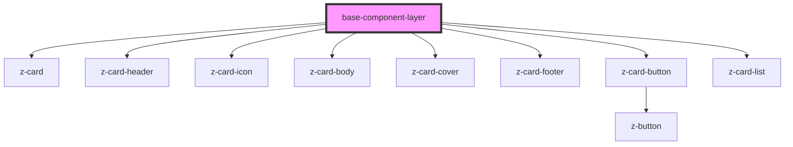

# base-component-layer

<!-- Auto Generated Below -->

## Properties

| Property | Attribute | Description | Type     | Default     |
| -------- | --------- | ----------- | -------- | ----------- |
| `myProp` | `my-prop` |             | `string` | `undefined` |

## Dependencies

### Depends on

- [z-card](../z-card)
- [z-card-header](../z-card-header)
- [z-card-icon](../z-card-icon)
- [z-card-body](../z-card-body)
- [z-card-cover](../z-card-cover)
- [z-card-footer](../z-card-footer)
- [z-card-button](../z-card-button)
- [z-card-list](../z-card-list)

### Graph

----------------------------------------------

*Built with [StencilJS](https://stenciljs.com/)*
