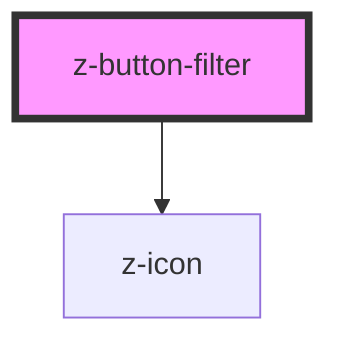

# z-button-filter

<!-- readme-group="buttons" -->

```html
<z-button-filter filtername="filter 1" isfixed></z-button-filter>
<z-button-filter filtername="filter 2"></z-button-filter>
<z-button-filter filtername="filter 3" isfixed hasicon="false"></z-button-filter>
<z-button-filter filtername="filter 4" hasicon="false"></z-button-filter>
```
<!-- Auto Generated Below -->


## Properties

| Property     | Attribute    | Description              | Type      | Default     |
| ------------ | ------------ | ------------------------ | --------- | ----------- |
| `filterid`   | `filterid`   | filter id                | `string`  | `undefined` |
| `filtername` | `filtername` | filter text content      | `string`  | `undefined` |
| `hasicon`    | `hasicon`    | add icon to button       | `boolean` | `true`      |
| `isfixed`    | `isfixed`    | disable action on button | `boolean` | `false`     |


## Events

| Event          | Description                                 | Type               |
| -------------- | ------------------------------------------- | ------------------ |
| `removefilter` | remove filter click event, returns filterid | `CustomEvent<any>` |


## Dependencies

### Depends on

- [z-icon](../z-icon)

### Graph


----------------------------------------------

*Built with [StencilJS](https://stenciljs.com/)*
