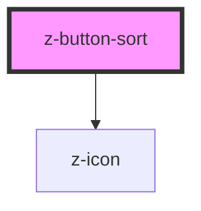

# z-button-sort

<!-- Auto Generated Below -->

## Properties

| Property        | Attribute       | Description | Type      | Default      |
| --------------- | --------------- | ----------- | --------- | ------------ |
| `buttonid`      | `buttonid`      |             | `string`  | `undefined`  |
| `counter`       | `counter`       |             | `number`  | `undefined`  |
| `desclabel`     | `desclabel`     |             | `string`  | `this.label` |
| `isselected`    | `isselected`    |             | `boolean` | `false`      |
| `label`         | `label`         |             | `string`  | `undefined`  |
| `sortasc`       | `sortasc`       |             | `boolean` | `true`       |
| `sortlabelasc`  | `sortlabelasc`  |             | `string`  | `'A-Z'`      |
| `sortlabeldesc` | `sortlabeldesc` |             | `string`  | `'Z-A'`      |

## Events

| Event             | Description | Type               |
| ----------------- | ----------- | ------------------ |
| `buttonSortClick` |             | `CustomEvent<any>` |

## Dependencies

### Depends on

- [z-icon](../z-icon)

### Graph

----------------------------------------------

*Built with [StencilJS](https://stenciljs.com/)*
