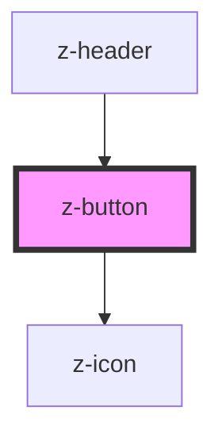

# z-button

<!-- readme-group="buttons" -->

```html
<z-button label="button" type="primary"></z-button>
<z-button label="button" type="primary" icon="download"></z-button>
<z-button label="button" type="primary" isdisabled icon="download"></z-button>
<z-button label="button" type="secondary"></z-button>
<z-button label="button" type="secondary" isdisabled></z-button>
<z-button label="button" type="tertiary"></z-button>
<z-button label="button" type="tertiary" isdisabled></z-button>
<z-button label="button" type="primary" issmall></z-button>
<z-button label="button" type="primary" issmall icon="download"></z-button>
<z-button label="button" type="primary" issmall isdisabled icon="download"></z-button>
<z-button label="button" type="secondary" issmall></z-button>
<z-button label="button" type="secondary" issmall isdisabled></z-button>
<z-button label="button" type="tertiary" issmall></z-button>
<z-button label="button" type="tertiary" issmall isdisabled></z-button>
```
<!-- Auto Generated Below -->


## Properties

| Property     | Attribute    | Description                      | Type      | Default     |
| ------------ | ------------ | -------------------------------- | --------- | ----------- |
| `buttonid`   | `buttonid`   | id, should be unique             | `string`  | `undefined` |
| `icon`       | `icon`       | add an icon to button (optional) | `string`  | `undefined` |
| `isdisabled` | `isdisabled` | disable button                   | `boolean` | `false`     |
| `issmall`    | `issmall`    | reduce button size (optional)    | `boolean` | `false`     |
| `label`      | `label`      | label content                    | `string`  | `undefined` |
| `type`       | `type`       | graphic variant                  | `string`  | `undefined` |


## Dependencies

### Used by

 - [z-header](../z-header)

### Depends on

- [z-icon](../z-icon)

### Graph


----------------------------------------------

*Built with [StencilJS](https://stenciljs.com/)*
