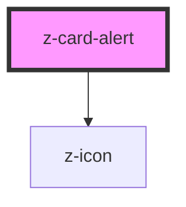

# z-card-alert

<!-- Auto Generated Below -->

## Properties

| Property      | Attribute     | Description | Type     | Default     |
| ------------- | ------------- | ----------- | -------- | ----------- |
| `actiontext`  | `actiontext`  |             | `string` | `undefined` |
| `contenttext` | `contenttext` |             | `string` | `undefined` |
| `iconname`    | `iconname`    |             | `string` | `undefined` |
| `type`        | `type`        |             | `string` | `undefined` |

## Events

| Event        | Description | Type               |
| ------------ | ----------- | ------------------ |
| `undoAction` |             | `CustomEvent<any>` |

## Dependencies

### Depends on

- [z-icon](../z-icon)

### Graph

----------------------------------------------

*Built with [StencilJS](https://stenciljs.com/)*
