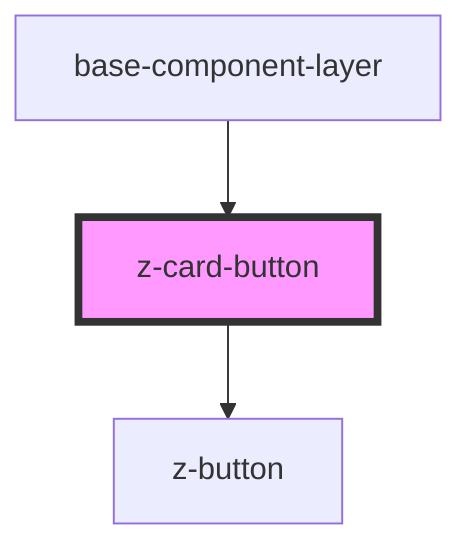

# z-card-button

<!-- Auto Generated Below -->

## Dependencies

### Used by

 - [base-component-layer](../baseComponentLayer)

### Depends on

- [z-button](../z-button)

### Graph

----------------------------------------------

*Built with [StencilJS](https://stenciljs.com/)*
