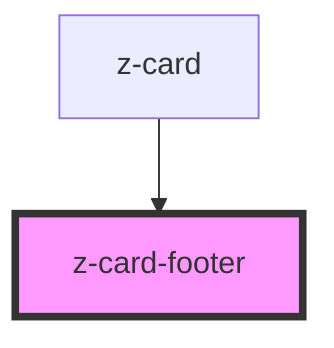

# z-card-footer

<!-- Auto Generated Below -->

## Properties

| Property         | Attribute   | Description | Type                      | Default     |
| ---------------- | ----------- | ----------- | ------------------------- | ----------- |
| `carddata`       | `carddata`  |             | `any`                     | `undefined` |
| `handlecardopen` | --          |             | `(e: MouseEvent) => void` | `undefined` |
| `hasbutton`      | `hasbutton` |             | `boolean`                 | `undefined` |
| `isopen`         | `isopen`    |             | `boolean`                 | `undefined` |

## Dependencies

### Used by

 - [z-card](..)

### Graph

----------------------------------------------

*Built with [StencilJS](https://stenciljs.com/)*
