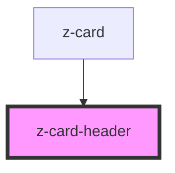

# z-card-header

<!-- Auto Generated Below -->

## Properties

| Property | Attribute | Description | Type     | Default     |
| -------- | --------- | ----------- | -------- | ----------- |
| `icon`   | `icon`    |             | `string` | `undefined` |
| `titolo` | `titolo`  |             | `string` | `undefined` |

## Events

| Event       | Description | Type               |
| ----------- | ----------- | ------------------ |
| `iconClick` |             | `CustomEvent<any>` |

## Dependencies

### Used by

 - [z-card](..)

### Graph

----------------------------------------------

*Built with [StencilJS](https://stenciljs.com/)*
