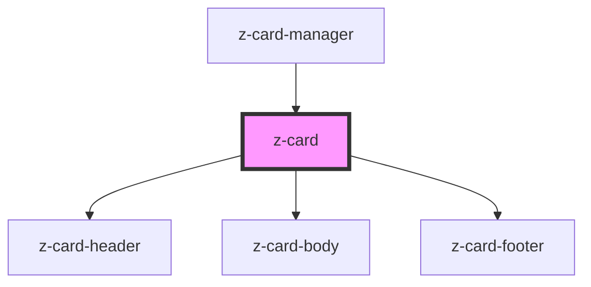

# z-card

<!-- Auto Generated Below -->

## Properties

| Property    | Attribute   | Description | Type      | Default     |
| ----------- | ----------- | ----------- | --------- | ----------- |
| `carddata`  | `carddata`  |             | `any`     | `undefined` |
| `cardtype`  | `cardtype`  |             | `string`  | `undefined` |
| `hasbutton` | `hasbutton` |             | `boolean` | `undefined` |
| `isremoved` | `isremoved` |             | `boolean` | `true`      |

## Events

| Event             | Description | Type               |
| ----------------- | ----------- | ------------------ |
| `headerIconClick` |             | `CustomEvent<any>` |

## Dependencies

### Used by

 - [z-card-manager](../z-card-manager)

### Depends on

- [z-card-header](z-card-header)
- [z-card-body](z-card-body)
- [z-card-footer](z-card-footer)

### Graph

----------------------------------------------

*Built with [StencilJS](https://stenciljs.com/)*
