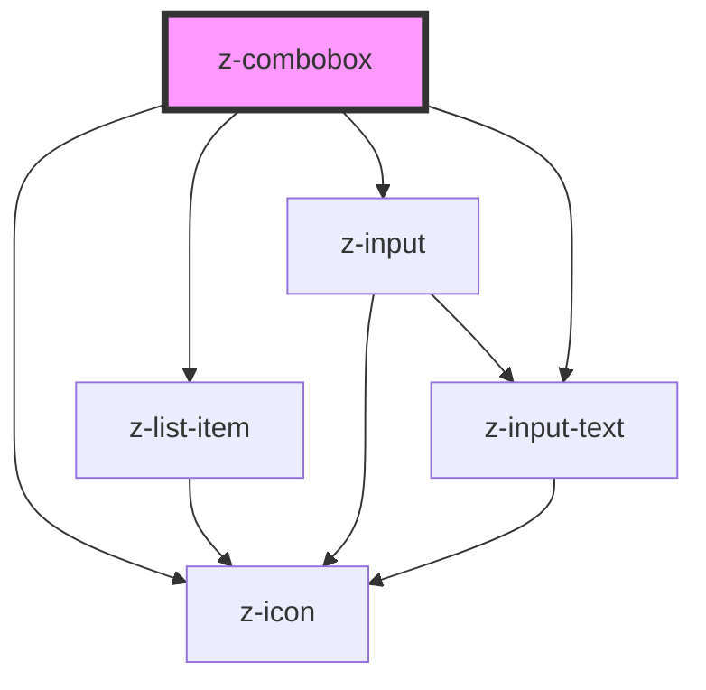

# z-combobox

<!-- Auto Generated Below -->

## Properties

| Property            | Attribute           | Description | Type                        | Default              |
| ------------------- | ------------------- | ----------- | --------------------------- | -------------------- |
| `closesearchtext`   | `closesearchtext`   |             | `string`                    | `undefined`          |
| `hassearch`         | `hassearch`         |             | `boolean`                   | `false`              |
| `inputid`           | `inputid`           |             | `string`                    | `undefined`          |
| `isfixed`           | `isfixed`           |             | `boolean`                   | `false`              |
| `isopen`            | `isopen`            |             | `boolean`                   | `true`               |
| `items`             | `items`             |             | `ComboItemBean[] \| string` | `undefined`          |
| `label`             | `label`             |             | `string`                    | `undefined`          |
| `noresultslabel`    | `noresultslabel`    |             | `string`                    | `"Nessun risultato"` |
| `searchlabel`       | `searchlabel`       |             | `string`                    | `undefined`          |
| `searchplaceholder` | `searchplaceholder` |             | `string`                    | `undefined`          |
| `searchtitle`       | `searchtitle`       |             | `string`                    | `undefined`          |

## Events

| Event            | Description | Type               |
| ---------------- | ----------- | ------------------ |
| `comboboxChange` |             | `CustomEvent<any>` |

## Dependencies

### Depends on

- [z-icon](../z-icon)
- [z-list-item](../z-list-item)
- [z-input](../z-input)
- [z-input-text](../z-input-text)

### Graph

----------------------------------------------

*Built with [StencilJS](https://stenciljs.com/)*
