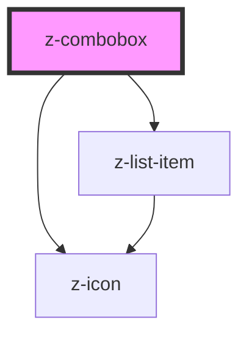

# z-combobox

<!-- Auto Generated Below -->

## Properties

| Property    | Attribute   | Description | Type                        | Default     |
| ----------- | ----------- | ----------- | --------------------------- | ----------- |
| `hassearch` | `hassearch` |             | `boolean`                   | `false`     |
| `inputid`   | `inputid`   |             | `string`                    | `undefined` |
| `items`     | `items`     |             | `ComboItemBean[] \| string` | `undefined` |
| `label`     | `label`     |             | `string`                    | `undefined` |

## Dependencies

### Depends on

- [z-icon](../z-icon)
- [z-list-item](../z-list-item)

### Graph

----------------------------------------------

*Built with [StencilJS](https://stenciljs.com/)*
