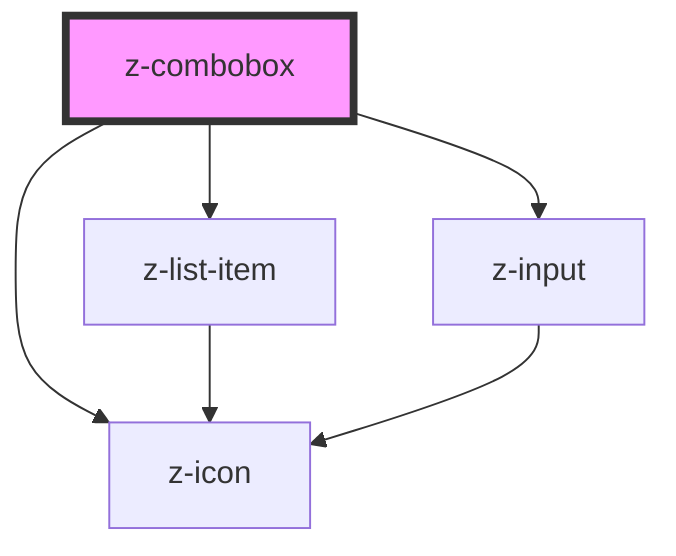

# z-combobox

<!-- readme-group="combobox" -->

```html
<z-combobox
  inputid="combo_1"
  items='[{"id":"item_1","name":"primo elemento","checked":false},{"id":"item_2","name":"secondo elemento","checked":true}]'
  hassearch="true"
  searchlabel="Autore"
  searchplaceholder="Cerca Autore"
  label="Combo Corta"
  closesearchtext="CHIUDI"
></z-combobox>
<z-combobox
  inputid="combo_2"
  items='[{"id":"item_1","name":"primo elemento","checked":false},{"id":"item_2","name":"secondo elemento","checked":true},{"id":"item_3","name":"terzo","checked":false},{"id":"item_4","name":"quarto elemento","checked":true},{"id":"item_5","name":"quinto elemento","checked":false},{"id":"item_6","name":"sesto elemento","checked":true}]'
  hassearch="true"
  searchlabel="Autore"
  searchplaceholder="Cerca Autore"
  label="Combo Corta"
  isopen="false"
  label="Combo Lunga"
  closesearchtext="CHIUDI"
></z-combobox>
```

<!-- Auto Generated Below -->


## Properties

| Property            | Attribute           | Description                              | Type                        | Default              |
| ------------------- | ------------------- | ---------------------------------------- | --------------------------- | -------------------- |
| `closesearchtext`   | `closesearchtext`   | close combobox list text                 | `string`                    | `undefined`          |
| `hassearch`         | `hassearch`         | show search input flag (optional)        | `boolean`                   | `false`              |
| `inputid`           | `inputid`           | input unique id                          | `string`                    | `undefined`          |
| `isfixed`           | `isfixed`           | fixed style flag                         | `boolean`                   | `false`              |
| `isopen`            | `isopen`            | toggle combo list opening flag           | `boolean`                   | `true`               |
| `items`             | `items`             | list items array                         | `ComboItemBean[] \| string` | `undefined`          |
| `label`             | `label`             | label text                               | `string`                    | `undefined`          |
| `noresultslabel`    | `noresultslabel`    | no result text message                   | `string`                    | `"Nessun risultato"` |
| `searchlabel`       | `searchlabel`       | search input label text (optional)       | `string`                    | `undefined`          |
| `searchplaceholder` | `searchplaceholder` | search input placeholder text (optional) | `string`                    | `undefined`          |
| `searchtitle`       | `searchtitle`       | search input title text (optional)       | `string`                    | `undefined`          |


## Events

| Event            | Description                                                 | Type               |
| ---------------- | ----------------------------------------------------------- | ------------------ |
| `comboboxChange` | Emitted when value is checked/unchecked. Returns id, items. | `CustomEvent<any>` |


## Dependencies

### Depends on

- [z-icon](../z-icon)
- [z-list-item](../z-list-item)
- [z-input](../z-input)

### Graph


----------------------------------------------

*Built with [StencilJS](https://stenciljs.com/)*
