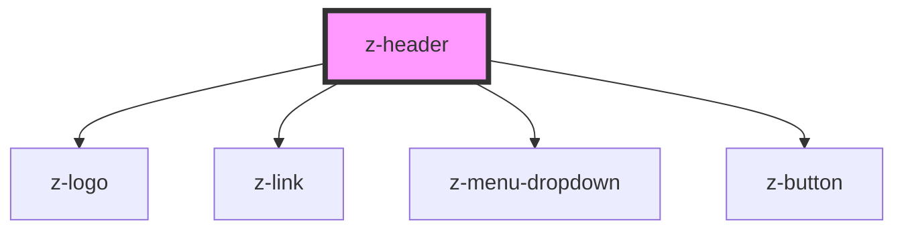

# z-header

<!-- Auto Generated Below -->

## Properties

| Property      | Attribute     | Description | Type      | Default     |
| ------------- | ------------- | ----------- | --------- | ----------- |
| `editors`     | `editors`     |             | `string`  | `undefined` |
| `extlinkdata` | `extlinkdata` |             | `string`  | `undefined` |
| `intlink`     | `intlink`     |             | `string`  | `undefined` |
| `intlinkdata` | `intlinkdata` |             | `string`  | `undefined` |
| `ismyz`       | `ismyz`       |             | `boolean` | `undefined` |
| `userdata`    | `userdata`    |             | `string`  | `undefined` |

## Dependencies

### Depends on

- [z-logo](../z-logo)
- [z-link](../z-link)
- [z-menu-dropdown](../z-menu-dropdown)
- [z-button](../z-button)

### Graph

----------------------------------------------

*Built with [StencilJS](https://stenciljs.com/)*
