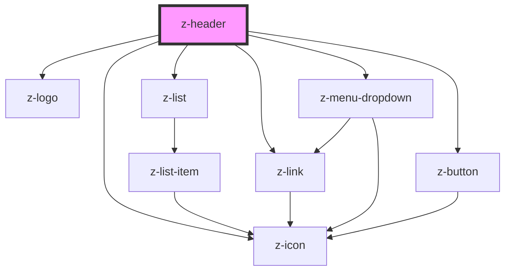

# z-header

<!-- Auto Generated Below -->

## Properties

| Property      | Attribute     | Description | Type                                                                                                     | Default     |
| ------------- | ------------- | ----------- | -------------------------------------------------------------------------------------------------------- | ----------- |
| `extlinkdata` | `extlinkdata` |             | `MenuItem[] \| string`                                                                                   | `undefined` |
| `imagealt`    | `imagealt`    |             | `string`                                                                                                 | `undefined` |
| `intlinkdata` | `intlinkdata` |             | `MenuItem[] \| string`                                                                                   | `undefined` |
| `ismyz`       | `ismyz`       |             | `boolean`                                                                                                | `undefined` |
| `logolink`    | `logolink`    |             | `string`                                                                                                 | `undefined` |
| `userdata`    | `userdata`    |             | `string \| { islogged: boolean; id?: number; name?: string; usergroup: number; userlinks: MenuItem[]; }` | `undefined` |

## Dependencies

### Depends on

- [z-logo](../z-logo)
- [z-list](../z-list)
- [z-link](../z-link)
- [z-menu-dropdown](../z-menu-dropdown)
- [z-button](../z-button)
- [z-icon](../z-icon)

### Graph

----------------------------------------------

*Built with [StencilJS](https://stenciljs.com/)*
