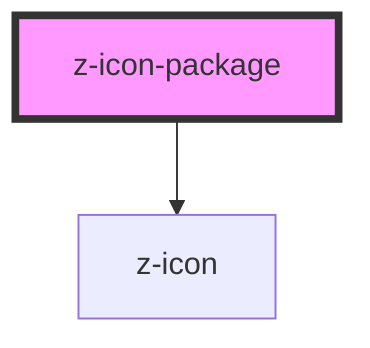

# z-icon-package

<!-- readme-group="icon" -->
```html
<!-- utility component to display all icons -->
<z-icon-package></z-icon-pacakge>
```

<!-- Auto Generated Below -->


## Dependencies

### Depends on

- [z-icon](../z-icon)

### Graph


----------------------------------------------

*Built with [StencilJS](https://stenciljs.com/)*
