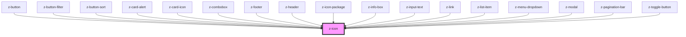

# z-icon

<!-- Auto Generated Below -->

## Properties

| Property | Attribute | Description | Type     | Default     |
| -------- | --------- | ----------- | -------- | ----------- |
| `height` | `height`  |             | `number` | `18`        |
| `iconid` | `iconid`  |             | `string` | `undefined` |
| `name`   | `name`    |             | `string` | `undefined` |
| `width`  | `width`   |             | `number` | `18`        |

## Dependencies

### Used by

 - [z-button](../z-button)
 - [z-button-filter](../z-button-filter)
 - [z-button-sort](../z-button-sort)
 - [z-card-alert](../z-card-alert)
 - [z-card-icon](../z-card-icon)
 - [z-combobox](../z-combobox)
 - [z-footer](../z-footer)
 - [z-header](../z-header)
 - [z-icon-package](../z-icon-package)
 - [z-info-box](../z-info-box)
 - [z-input-text](../z-input-text)
 - [z-link](../z-link)
 - [z-list-item](../z-list-item)
 - [z-menu-dropdown](../z-menu-dropdown)
 - [z-modal](../z-modal)
 - [z-pagination-bar](../z-pagination-bar)
 - [z-toggle-button](../z-toggle-button)

### Graph

----------------------------------------------

*Built with [StencilJS](https://stenciljs.com/)*
