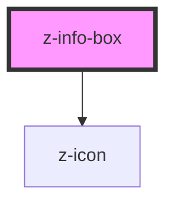

# z-info-box

<!-- readme-group="infobox" -->

<!-- Auto Generated Below -->

## Properties

| Property     | Attribute    | Description | Type      | Default     |
| ------------ | ------------ | ----------- | --------- | ----------- |
| `boxid`      | `boxid`      |             | `string`  | `undefined` |
| `isclosable` | `isclosable` |             | `boolean` | `true`      |

## Events

| Event          | Description | Type               |
| -------------- | ----------- | ------------------ |
| `infoBoxClose` |             | `CustomEvent<any>` |

## Dependencies

### Depends on

- [z-icon](../z-icon)

### Graph

----------------------------------------------

*Built with [StencilJS](https://stenciljs.com/)*
