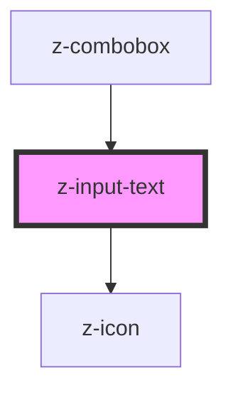

# z-input-text

<!-- readme-group="input" -->
```html
<!-- type text -->
<z-input-text label="default" placeholder="Cerca Autore"></z-input-text>
<z-input-text label="filled" value="testo testo testo"></z-input-text>
<z-input-text label="disabled" placeholder="placeholder" isdisabled value="i'm disabled"></z-input-text>
<z-input-text label="readonly" placeholder="placeholder" isreadonly value="i'm read-only"></z-input-text>
<z-input-text label="success" placeholder="placeholder" status="success" message="message message" value=""></z-input-text>
<z-input-text label="error" placeholder="placeholder" status="error" message="message message" value="testo"></z-input-text>
<z-input-text label="warning" placeholder="placeholder" status="warning" message="message message message message message message message message message message message message message message message message message message"></z-input-text>
<z-input-text label="message" placeholder="placeholder" message="helper message"></z-input-text>
<!-- type textarea -->
<z-input-text type="textarea"></z-input-text>
<z-input-text type="textarea" label="default" placeholder="Cerca Autore"></z-input-text>
<z-input-text type="textarea" label="filled" value="testo testo testo"></z-input-text>
<z-input-text type="textarea" label="disabled" placeholder="placeholder" isdisabled value="i'm disabled"></z-input-text>
<z-input-text type="textarea" label="readonly" placeholder="placeholder" isreadonly value="i'm read-only"></z-input-text>
<z-input-text type="textarea" label="success" placeholder="placeholder" status="success" message="message message" value=""></z-input-text>
<z-input-text type="textarea" label="error" placeholder="placeholder" status="error" message="message message" value="testo"></z-input-text>
<z-input-text type="textarea" label="warning" placeholder="placeholder" status="warning" message="message message"></z-input-text>
<z-input-text type="textarea" label="message" placeholder="placeholder" message="helper message"></z-input-text>
```

<!-- Auto Generated Below -->


## Properties

| Property        | Attribute        | Description                                                   | Type                                                                                                                    | Default     |
| --------------- | ---------------- | ------------------------------------------------------------- | ----------------------------------------------------------------------------------------------------------------------- | ----------- |
| `htmltitle`     | `htmltitle`      | input html title (optional)                                   | `string`                                                                                                                | `undefined` |
| `inputid`       | `inputid`        | html input unique id                                          | `string`                                                                                                                | `undefined` |
| `isdisabled`    | `isdisabled`     | disable input flag                                            | `boolean`                                                                                                               | `false`     |
| `isreadonly`    | `isreadonly`     | readonly input flag                                           | `boolean`                                                                                                               | `false`     |
| `label`         | `label`          | input label text (optional)                                   | `string`                                                                                                                | `undefined` |
| `message`       | `message`        | input helper message (optional)                               | `string`                                                                                                                | `undefined` |
| `placeholder`   | `placeholder`    | input placeholder (optional)                                  | `string`                                                                                                                | `undefined` |
| `status`        | `status`         | input status (optional)                                       | `InputStatusEnum.error \| InputStatusEnum.success \| InputStatusEnum.warning`                                           | `undefined` |
| `type`          | `type`           | input html type, can be text or textarea (optional)           | `InputTypeEnum.email \| InputTypeEnum.number \| InputTypeEnum.password \| InputTypeEnum.text \| InputTypeEnum.textarea` | `undefined` |
| `typingTimeout` | `typing-timeout` | timeout setting before trigger `inputChange` event (optional) | `number`                                                                                                                | `300`       |
| `value`         | `value`          | input value (mutable, optional)                               | `string`                                                                                                                | `undefined` |


## Events

| Event         | Description                                           | Type               |
| ------------- | ----------------------------------------------------- | ------------------ |
| `inputChange` | emitted on input value change, returns value, keycode | `CustomEvent<any>` |


## Methods

### `getValue() => Promise<string>`

get the input value

#### Returns

Type: `Promise<string>`


### `setValue(value: string) => Promise<void>`

set the input value

#### Returns

Type: `Promise<void>`


## Dependencies

### Used by

 - [z-combobox](../z-combobox)

### Depends on

- [z-icon](../z-icon)

### Graph


----------------------------------------------

*Built with [StencilJS](https://stenciljs.com/)*
