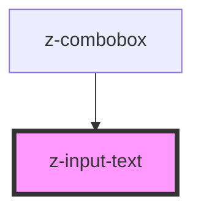

# z-input-text

<!-- Auto Generated Below -->

## Properties

| Property      | Attribute     | Description | Type     | Default     |
| ------------- | ------------- | ----------- | -------- | ----------- |
| `inputid`     | `inputid`     |             | `string` | `undefined` |
| `label`       | `label`       |             | `string` | `undefined` |
| `placeholder` | `placeholder` |             | `string` | `undefined` |
| `type`        | `type`        |             | `string` | `'text'`    |
| `value`       | `value`       |             | `string` | `undefined` |

## Events

| Event         | Description | Type               |
| ------------- | ----------- | ------------------ |
| `inputChange` |             | `CustomEvent<any>` |

## Dependencies

### Used by

 - [z-combobox](../z-combobox)

### Graph

----------------------------------------------

*Built with [StencilJS](https://stenciljs.com/)*
