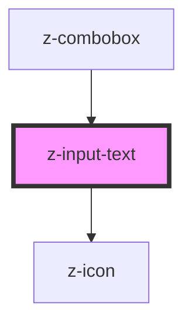

# z-input-text

<!-- Auto Generated Below -->

## Properties

| Property        | Attribute        | Description | Type                                                                                          | Default     |
| --------------- | ---------------- | ----------- | --------------------------------------------------------------------------------------------- | ----------- |
| `inputid`       | `inputid`        |             | `string`                                                                                      | `undefined` |
| `isdisabled`    | `isdisabled`     |             | `boolean`                                                                                     | `false`     |
| `isreadonly`    | `isreadonly`     |             | `boolean`                                                                                     | `false`     |
| `label`         | `label`          |             | `string`                                                                                      | `undefined` |
| `message`       | `message`        |             | `string`                                                                                      | `undefined` |
| `placeholder`   | `placeholder`    |             | `string`                                                                                      | `undefined` |
| `status`        | `status`         |             | `InputStatusEnum.error \| InputStatusEnum.success \| InputStatusEnum.warning`                 | `undefined` |
| `type`          | `type`           |             | `InputTypeEnum.email \| InputTypeEnum.number \| InputTypeEnum.password \| InputTypeEnum.text` | `undefined` |
| `typingTimeout` | `typing-timeout` |             | `number`                                                                                      | `300`       |
| `value`         | `value`          |             | `string`                                                                                      | `undefined` |

## Events

| Event         | Description | Type               |
| ------------- | ----------- | ------------------ |
| `inputChange` |             | `CustomEvent<any>` |

## Methods

### `getValue() => Promise<string>`

#### Returns

Type: `Promise<string>`

## Dependencies

### Used by

 - [z-combobox](../z-combobox)

### Depends on

- [z-icon](../z-icon)

### Graph

----------------------------------------------

*Built with [StencilJS](https://stenciljs.com/)*
