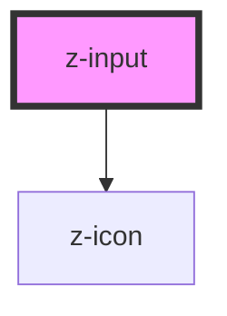

# z-input

<!-- Auto Generated Below -->

## Properties

| Property     | Attribute    | Description                                      | Type                                                                                                                                              | Default     |
| ------------ | ------------ | ------------------------------------------------ | ------------------------------------------------------------------------------------------------------------------------------------------------- | ----------- |
| `checked`    | `checked`    | checked: available for checkbox                  | `boolean`                                                                                                                                         | `false`     |
| `htmlid`     | `htmlid`     | the id of the input element                      | `string`                                                                                                                                          | `undefined` |
| `label`      | `label`      | the input label                                  | `string`                                                                                                                                          | `undefined` |
| `labelafter` | `labelafter` | the input label position: available for checkbox | `boolean`                                                                                                                                         | `true`      |
| `type`       | `type`       | input types                                      | `InputTypeEnum.checkbox \| InputTypeEnum.email \| InputTypeEnum.number \| InputTypeEnum.password \| InputTypeEnum.text \| InputTypeEnum.textarea` | `undefined` |

## Methods

### `isChecked() => Promise<boolean>`

#### Returns

Type: `Promise<boolean>`

## Dependencies

### Depends on

- [z-icon](../z-icon)

### Graph

----------------------------------------------

*Built with [StencilJS](https://stenciljs.com/)*
