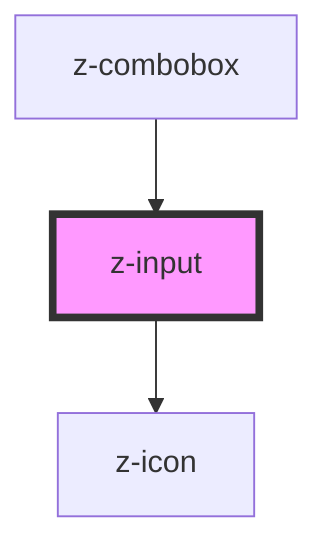

# z-input

<!-- Auto Generated Below -->

## Properties

| Property        | Attribute        | Description                                                   | Type                                                                          | Default      |
| --------------- | ---------------- | ------------------------------------------------------------- | ----------------------------------------------------------------------------- | ------------ |
| `checked`       | `checked`        | checked: available for checkbox, radio                        | `boolean`                                                                     | `false`      |
| `disabled`      | `disabled`       | the input is disabled                                         | `boolean`                                                                     | `false`      |
| `htmlid`        | `htmlid`         | the id of the input element                                   | `string`                                                                      | `randomId()` |
| `htmltitle`     | `htmltitle`      | the input html title (optional)                               | `string`                                                                      | `undefined`  |
| `label`         | `label`          | the input label                                               | `string`                                                                      | `undefined`  |
| `labelafter`    | `labelafter`     | the input label position: available for checkbox, radio       | `boolean`                                                                     | `true`       |
| `message`       | `message`        | input helper message (optional)                               | `string`                                                                      | `undefined`  |
| `name`          | `name`           | the input name                                                | `string`                                                                      | `undefined`  |
| `placeholder`   | `placeholder`    | the input placeholder (optional)                              | `string`                                                                      | `undefined`  |
| `readonly`      | `readonly`       | the input is readonly                                         | `boolean`                                                                     | `false`      |
| `status`        | `status`         | the input status (optional)                                   | `InputStatusEnum.error \| InputStatusEnum.success \| InputStatusEnum.warning` | `undefined`  |
| `type`          | `type`           | input types                                                   | `string`                                                                      | `undefined`  |
| `typingTimeout` | `typing-timeout` | timeout setting before trigger `inputChange` event (optional) | `number`                                                                      | `300`        |
| `value`         | `value`          | the input value                                               | `string`                                                                      | `undefined`  |

## Events

| Event         | Description                                            | Type               |
| ------------- | ------------------------------------------------------ | ------------------ |
| `inputChange` | Emitted on input value change, returns value, keycode  | `CustomEvent<any>` |
| `inputCheck`  | Emitted on checkbox check/uncheck, returns id, checked | `CustomEvent<any>` |

## Methods

### `getValue() => Promise<string>`

get the input value

#### Returns

Type: `Promise<string>`

### `isChecked() => Promise<boolean>`

get checked status

#### Returns

Type: `Promise<boolean>`

### `setValue(value: string) => Promise<void>`

set the input value

#### Returns

Type: `Promise<void>`

## Dependencies

### Used by

 - [z-combobox](../z-combobox)

### Depends on

- [z-icon](../z-icon)

### Graph

----------------------------------------------

*Built with [StencilJS](https://stenciljs.com/)*
