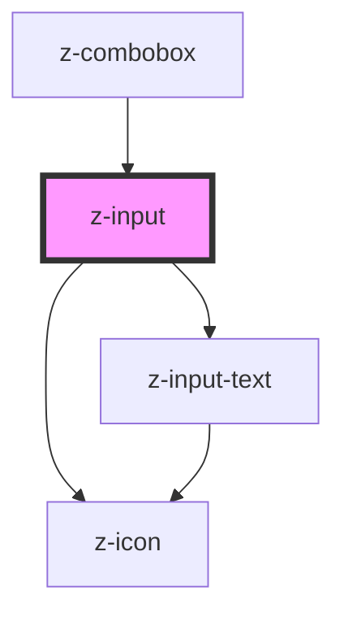

# z-input

<!-- Auto Generated Below -->

## Properties

| Property     | Attribute    | Description                                             | Type      | Default           |
| ------------ | ------------ | ------------------------------------------------------- | --------- | ----------------- |
| `checked`    | `checked`    | checked: available for checkbox, radio                  | `boolean` | `false`           |
| `disabled`   | `disabled`   | the input is disabled                                   | `boolean` | `false`           |
| `htmlid`     | `htmlid`     | the id of the input element                             | `string`  | `this.randomId()` |
| `label`      | `label`      | the input label                                         | `string`  | `undefined`       |
| `labelafter` | `labelafter` | the input label position: available for checkbox, radio | `boolean` | `true`            |
| `name`       | `name`       | the input name                                          | `string`  | `undefined`       |
| `readonly`   | `readonly`   | the input is readonly                                   | `boolean` | `false`           |
| `type`       | `type`       | input types                                             | `string`  | `undefined`       |
| `value`      | `value`      | the input value                                         | `string`  | `undefined`       |

## Events

| Event        | Description | Type               |
| ------------ | ----------- | ------------------ |
| `inputCheck` |             | `CustomEvent<any>` |

## Methods

### `isChecked() => Promise<boolean>`

#### Returns

Type: `Promise<boolean>`

## Dependencies

### Used by

 - [z-combobox](../z-combobox)

### Depends on

- [z-icon](../z-icon)
- [z-input-text](../z-input-text)

### Graph

----------------------------------------------

*Built with [StencilJS](https://stenciljs.com/)*
