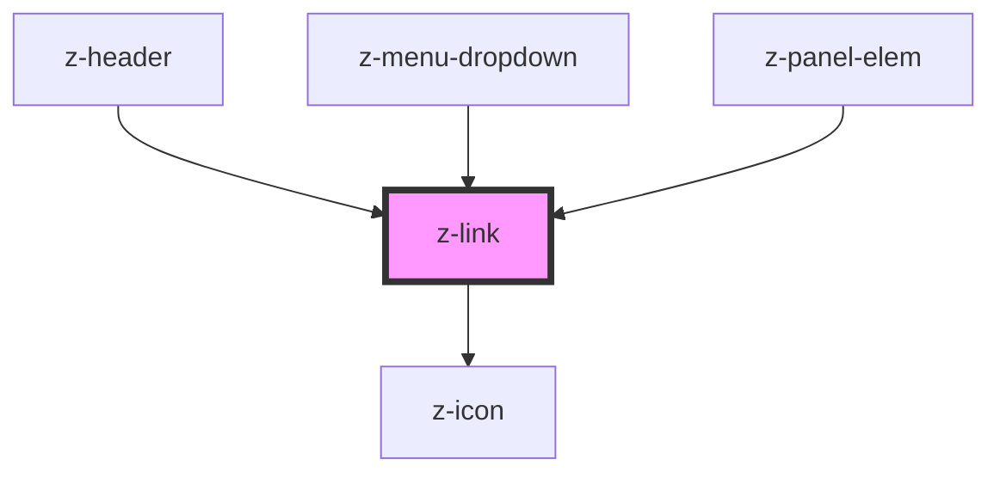

# z-link

<!-- readme-group="link" -->
```html
<z-link label="z-link"></z-link>
<z-link label="z-link" icon="download"></z-link>
<z-link label="z-link" isdisabled></z-link>
<z-link label="z-link" isdisabled icon="download"></z-link>
```


<!-- Auto Generated Below -->


## Properties

| Property       | Attribute      | Description                   | Type      | Default     |
| -------------- | -------------- | ----------------------------- | --------- | ----------- |
| `icon`         | `icon`         | link icon name (optional)     | `string`  | `undefined` |
| `isdisabled`   | `isdisabled`   | disable link flag (optional)  | `boolean` | `false`     |
| `iswhite`      | `iswhite`      | white variant flag (optional) | `boolean` | `false`     |
| `label`        | `label`        | link label (optional)         | `string`  | `undefined` |
| `linkid`       | `linkid`       | link id (optional)            | `string`  | `undefined` |
| `linktabindex` | `linktabindex` | tabindex link attribute       | `number`  | `0`         |
| `target`       | `target`       | link target (optional)        | `string`  | `"_self"`   |
| `url`          | `url`          | link url                      | `string`  | `undefined` |


## Events

| Event        | Description                           | Type               |
| ------------ | ------------------------------------- | ------------------ |
| `zLinkClick` | emitted on link click, returns linkId | `CustomEvent<any>` |


## Dependencies

### Used by

 - [z-header](../z-header)
 - [z-menu-dropdown](../z-menu-dropdown)
 - [z-panel-elem](../z-panel-elem)

### Depends on

- [z-icon](../z-icon)

### Graph


----------------------------------------------

*Built with [StencilJS](https://stenciljs.com/)*
