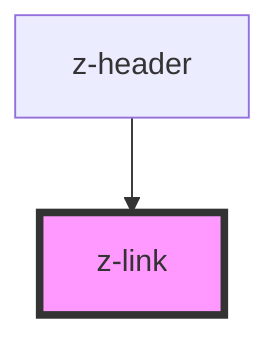

# z-link

<!-- Auto Generated Below -->

## Properties

| Property     | Attribute    | Description | Type      | Default     |
| ------------ | ------------ | ----------- | --------- | ----------- |
| `icon`       | `icon`       |             | `string`  | `undefined` |
| `isdisabled` | `isdisabled` |             | `boolean` | `false`     |
| `iswhite`    | `iswhite`    |             | `boolean` | `false`     |
| `label`      | `label`      |             | `string`  | `undefined` |
| `linkid`     | `linkid`     |             | `string`  | `undefined` |
| `target`     | `target`     |             | `string`  | `'_self'`   |
| `url`        | `url`        |             | `string`  | `undefined` |

## Events

| Event        | Description | Type               |
| ------------ | ----------- | ------------------ |
| `zLinkClick` |             | `CustomEvent<any>` |

## Dependencies

### Used by

 - [z-header](../z-header)

### Graph

----------------------------------------------

*Built with [StencilJS](https://stenciljs.com/)*
