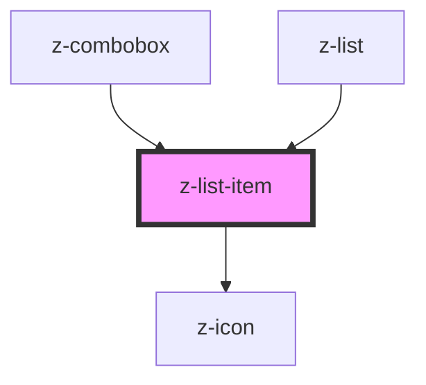

# z-list-item

<!-- Auto Generated Below -->

## Properties

| Property     | Attribute    | Description | Type      | Default     |
| ------------ | ------------ | ----------- | --------- | ----------- |
| `action`     | `action`     |             | `string`  | `undefined` |
| `icon`       | `icon`       |             | `string`  | `undefined` |
| `link`       | `link`       |             | `string`  | `undefined` |
| `linktarget` | `linktarget` |             | `string`  | `'_self'`   |
| `listitemid` | `listitemid` |             | `string`  | `undefined` |
| `text`       | `text`       |             | `string`  | `undefined` |
| `underlined` | `underlined` |             | `boolean` | `true`      |

## Events

| Event                | Description | Type               |
| -------------------- | ----------- | ------------------ |
| `zListItemLinkClick` |             | `CustomEvent<any>` |

## Dependencies

### Used by

 - [z-combobox](../z-combobox)
 - [z-list](../z-list)

### Depends on

- [z-icon](../z-icon)

### Graph

----------------------------------------------

*Built with [StencilJS](https://stenciljs.com/)*
