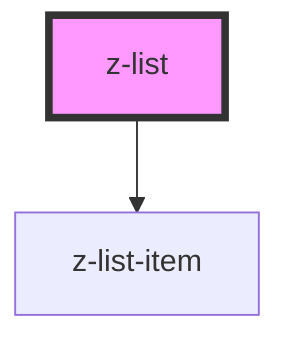

# z-list

<!-- Auto Generated Below -->

## Properties

| Property       | Attribute      | Description | Type             | Default     |
| -------------- | -------------- | ----------- | ---------------- | ----------- |
| `inputrawdata` | `inputrawdata` |             | `string`         | `undefined` |
| `list`         | --             |             | `ListItemBean[]` | `undefined` |

## Dependencies

### Depends on

- [z-list-item](../z-list-item)

### Graph

----------------------------------------------

*Built with [StencilJS](https://stenciljs.com/)*
