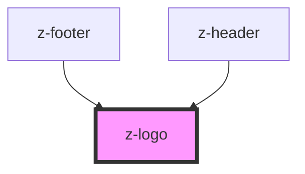

# z-logo

<!-- Auto Generated Below -->

## Properties

| Property      | Attribute     | Description | Type      | Default     |
| ------------- | ------------- | ----------- | --------- | ----------- |
| `height`      | `height`      |             | `number`  | `42`        |
| `imagealt`    | `imagealt`    |             | `string`  | `undefined` |
| `link`        | `link`        |             | `string`  | `undefined` |
| `targetblank` | `targetblank` |             | `boolean` | `undefined` |
| `width`       | `width`       |             | `number`  | `163`       |

## Dependencies

### Used by

 - [z-footer](../z-footer)
 - [z-header](../z-header)

### Graph

----------------------------------------------

*Built with [StencilJS](https://stenciljs.com/)*
