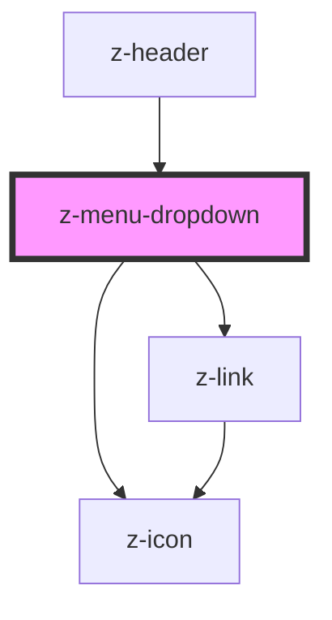

# z-menu-dropdown

<!-- Auto Generated Below -->

## Properties

| Property      | Attribute     | Description | Type                           | Default     |
| ------------- | ------------- | ----------- | ------------------------------ | ----------- |
| `buttonid`    | `buttonid`    |             | `string`                       | `undefined` |
| `menucontent` | `menucontent` |             | `MenuDropdownItem[] \| string` | `undefined` |
| `nomeutente`  | `nomeutente`  |             | `string`                       | `undefined` |

## Dependencies

### Used by

 - [z-header](../z-header)

### Depends on

- [z-link](../z-link)
- [z-icon](../z-icon)

### Graph

----------------------------------------------

*Built with [StencilJS](https://stenciljs.com/)*
