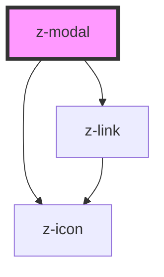

# z-modal

<!-- Auto Generated Below -->

## Properties

| Property        | Attribute       | Description | Type     | Default     |
| --------------- | --------------- | ----------- | -------- | ----------- |
| `closelabel`    | `closelabel`    |             | `string` | `'chiudi'`  |
| `modalid`       | `modalid`       |             | `string` | `undefined` |
| `modalsubtitle` | `modalsubtitle` |             | `string` | `undefined` |
| `modaltitle`    | `modaltitle`    |             | `string` | `undefined` |

## Events

| Event        | Description | Type               |
| ------------ | ----------- | ------------------ |
| `modalClose` |             | `CustomEvent<any>` |

## Dependencies

### Depends on

- [z-link](../z-link)
- [z-icon](../z-icon)

### Graph

----------------------------------------------

*Built with [StencilJS](https://stenciljs.com/)*
