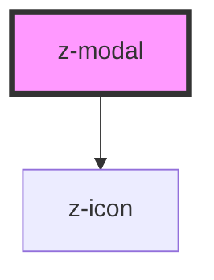

# z-modal

<!-- readme-group="modal" -->

<!-- Auto Generated Below -->

## Properties

| Property        | Attribute       | Description | Type     | Default     |
| --------------- | --------------- | ----------- | -------- | ----------- |
| `modalid`       | `modalid`       |             | `string` | `undefined` |
| `modalsubtitle` | `modalsubtitle` |             | `string` | `undefined` |
| `modaltitle`    | `modaltitle`    |             | `string` | `undefined` |

## Events

| Event               | Description | Type               |
| ------------------- | ----------- | ------------------ |
| `modalClose`        |             | `CustomEvent<any>` |
| `modalHeaderActive` |             | `CustomEvent<any>` |

## Dependencies

### Depends on

- [z-icon](../z-icon)

### Graph

----------------------------------------------

*Built with [StencilJS](https://stenciljs.com/)*
