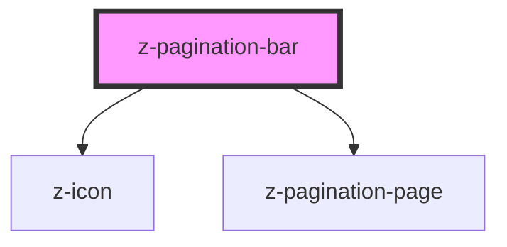

# z-pagination-bar

<!-- Auto Generated Below -->

## Properties

| Property         | Attribute      | Description | Type       | Default     |
| ---------------- | -------------- | ----------- | ---------- | ----------- |
| `currentpage`    | `currentpage`  |             | `number`   | `1`         |
| `historyraw`     | `historyraw`   |             | `string`   | `undefined` |
| `listhistoryrow` | --             |             | `number[]` | `[]`        |
| `pages`          | `pages`        |             | `number`   | `undefined` |
| `startpage`      | `startpage`    |             | `number`   | `1`         |
| `visiblepages`   | `visiblepages` |             | `number`   | `undefined` |

## Events

| Event              | Description | Type               |
| ------------------ | ----------- | ------------------ |
| `addPageToHistory` |             | `CustomEvent<any>` |
| `changeStartPage`  |             | `CustomEvent<any>` |
| `goToPage`         |             | `CustomEvent<any>` |

## Dependencies

### Depends on

- [z-icon](../z-icon)
- [z-pagination-page](../z-pagination-page)

### Graph

----------------------------------------------

*Built with [StencilJS](https://stenciljs.com/)*
