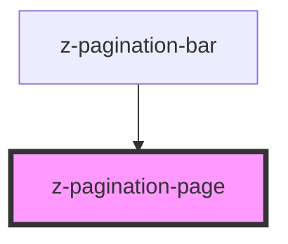

# z-pagination-page

<!-- readme-group="pagination" -->

<!-- Auto Generated Below -->

## Properties

| Property     | Attribute    | Description | Type      | Default     |
| ------------ | ------------ | ----------- | --------- | ----------- |
| `isdisabled` | `isdisabled` |             | `boolean` | `false`     |
| `isselected` | `isselected` |             | `boolean` | `false`     |
| `isvisited`  | `isvisited`  |             | `boolean` | `false`     |
| `pageid`     | `pageid`     |             | `string`  | `undefined` |
| `value`      | `value`      |             | `number`  | `undefined` |

## Dependencies

### Used by

 - [z-pagination-bar](../z-pagination-bar)

### Graph

----------------------------------------------

*Built with [StencilJS](https://stenciljs.com/)*
