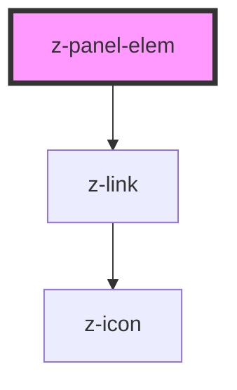

# z-panel-elem

<!-- Auto Generated Below -->

## Properties

| Property          | Attribute         | Description | Type      | Default     |
| ----------------- | ----------------- | ----------- | --------- | ----------- |
| `descr_slot_name` | `descr_slot_name` |             | `string`  | `undefined` |
| `elemid`          | `elemid`          |             | `string`  | `undefined` |
| `imgalt`          | `imgalt`          |             | `string`  | `undefined` |
| `imgurl`          | `imgurl`          |             | `string`  | `undefined` |
| `isdisabled`      | `isdisabled`      |             | `boolean` | `false`     |
| `linkicon`        | `linkicon`        |             | `string`  | `undefined` |
| `linklabel`       | `linklabel`       |             | `string`  | `undefined` |
| `target`          | `target`          |             | `string`  | `"_blank"`  |
| `url`             | `url`             |             | `string`  | `undefined` |

## Dependencies

### Depends on

- [z-link](../z-link)

### Graph

----------------------------------------------

*Built with [StencilJS](https://stenciljs.com/)*
