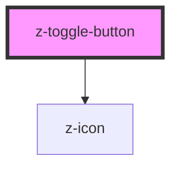

# z-toggle-button

<!-- readme-group="buttons" -->

<!-- Auto Generated Below -->

## Properties

| Property     | Attribute    | Description | Type      | Default     |
| ------------ | ------------ | ----------- | --------- | ----------- |
| `avoidclick` | `avoidclick` |             | `boolean` | `undefined` |
| `isdisabled` | `isdisabled` |             | `boolean` | `false`     |
| `label`      | `label`      |             | `string`  | `undefined` |

## Events

| Event         | Description | Type               |
| ------------- | ----------- | ------------------ |
| `toggleClick` |             | `CustomEvent<any>` |

## Dependencies

### Depends on

- [z-icon](../z-icon)

### Graph

----------------------------------------------

*Built with [StencilJS](https://stenciljs.com/)*
